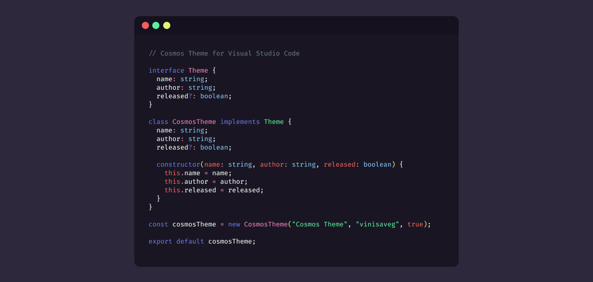

<p align="center">
   
</p>

<h1 align="center">
    Cosmos Theme
</h1>

<p align="center">
    An outta space Visual Studio Code theme
</p>

<p align="center">
   
</p>

## Color Palette

<p align="center">
    
</p>

## Installing from Visual Studio Code Marketplace

You can install directly from the Extensions tab hitting (CTRL + Shift + X), and searching for **cosmos-theme**.

## Installing locally

To create the theme you will need [Node.js](https://nodejs.org/en/) installed.

First clone this repo

```

    git clone https://github.com/vinisaveg/cosmos-theme.git

    cd cosmos-theme

```

To generate the theme you will need Visual Studio Code Extension Manager

```

    npm i -g vsce

```

Generate the theme as a vsix package

```

    vsce package

```

Installing the theme

```

    code --install-extension ./cosmos-theme-1.0.0.vsix

```

## Contributing

This theme will always be open to the community. Feel free to send any suggestion, feature, bug fixes or anything to help it's development.

## Issues

Found any bug? Feel free to report it.
